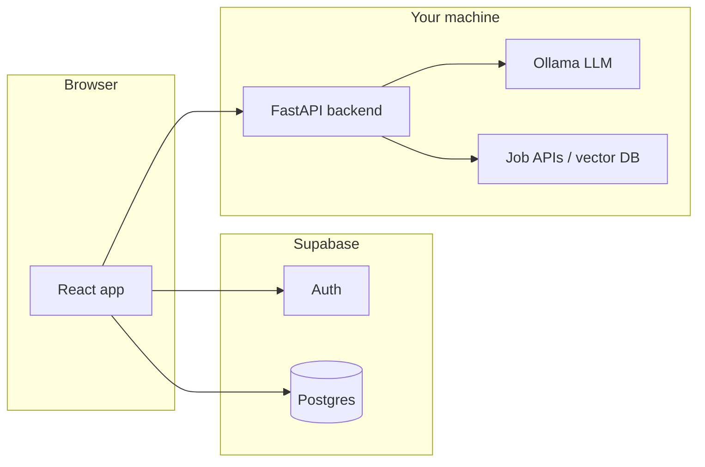

# How the app works + what to test manually

This document is for anyone new to the repo: a plain-language architecture overview, then a **manual test plan** you can execute and mark pass/fail.

For an older checklist with historical notes, see `TESTING-CHECKLIST.md`.

---

## Part 1 — How the code is organized

### Big picture

The product is a **web app** with three main pieces:

1. **React frontend** (Vite) — what users see in the browser. Lives in `frontend/`.
2. **Python API** (FastAPI) — AI and job-search logic. Lives in `backend/`.
3. **Supabase** — hosted **auth** (login/signup) and **Postgres** tables (profiles, saved jobs, applications, etc.). Configured via keys in `frontend/.env`.

The frontend talks to **Supabase** directly for auth and most user data. It talks to your **FastAPI backend** for things like resume parsing, job search, match scoring, chat, and the career roadmap (those routes all live under `/api/...`).

### Frontend (`frontend/src/`)

| Area | Role |
|------|------|
| `main.tsx` | **Routes**: landing, sign-in/up, dashboard pages, `/saved`, `/applied`, `/insights`, `/settings`, etc. Many dashboard routes are wrapped in `ProtectedRoute` (must be logged in). |
| `context/AuthContext.tsx` | Holds the logged-in user from Supabase; `access_token` is also stored in `localStorage` for API calls. |
| `lib/supabase.ts` | Supabase client (needs `VITE_SUPABASE_URL` + `VITE_SUPABASE_ANON_KEY`). |
| `lib/api.ts` | **HTTP client** for the Python API: builds `VITE_API_URL + /api + path`, attaches `Authorization: Bearer <token>`. |
| `api/jobs.ts` | Job search helpers (often calling backend or external search — follow this file for the real job source). |
| `hooks/useJobs.ts` | Loads jobs for the main search page and triggers batch match scoring. |
| `ui/pages/*` | Logged-in screens: Search, Resume (upload + match tabs), Recent, Saved, Applied, Roadmap, Auto Apply, Settings, Insights. |
| `pages/*` | Public pages: Landing, SignIn, SignUp, public Roadmap marketing page, etc. |
| `ui/components/IconSidebar.tsx` | Left nav for the dashboard. |

**Important:** Some screens call the API with **raw `fetch`** (e.g. dashboard Roadmap) instead of `lib/api.ts`. Both need **`VITE_API_URL`** to point at wherever uvicorn runs (often `http://localhost:8001`).

### Backend (`backend/`)

| File / folder | Role |
|---------------|------|
| `main.py` | Creates the FastAPI `app`, enables **CORS** for the Vite dev origin, mounts routers: `/api/auth/*` and `/api/*` (agent routes). |
| `routers/agent_router.py` | Main AI/job endpoints: resume extract/parse, job search, job score, chat, roadmap, optional SQLite profile. |
| `routers/auth_router.py` | Optional email/password auth against a backend DB (the app may use **Supabase auth only** on the frontend — check whether this is still used). |
| `agents/` | LangChain/LangGraph “agents”: resume processing, job search, job match scoring, chat RAG, etc. |
| `utils/llm_factory.py` | Builds **Ollama** chat models (`OLLAMA_MODEL`, `OLLAMA_BASE_URL`). |
| `utils/database.py`, `utils/vector_db.py` | Backend database / vector store (used by agents — not the same as Supabase). |

**Health check:** `GET http://<host>:<port>/` returns a short JSON message.

### Where data lives

| Data | Typical store |
|------|----------------|
| User login, session | **Supabase Auth** |
| Profile, resume metadata, `resume_text`, preferences | **Supabase** `profiles` (and related tables) |
| Saved jobs, applications, auto-apply settings | **Supabase** tables (`saved_jobs`, `applications`, `autoapply_settings`, etc.) |
| Some legacy / orchestration flows | Backend **SQLite** or **Postgres** (see `utils/database.py` and migrations) — can overlap conceptually with Supabase; when debugging, check **which** code path writes where. |

If something “doesn’t persist,” compare the page’s code: is it writing to **Supabase** or only to **local state**?

### Environment variables (minimum to understand)

**Frontend (`frontend/.env`):**

- `VITE_SUPABASE_URL`, `VITE_SUPABASE_ANON_KEY` — required for auth and DB.
- `VITE_API_URL` — base URL of FastAPI **without** `/api` (e.g. `http://127.0.0.1:8001`).

**Backend (`backend/.env`):**

- `OLLAMA_BASE_URL`, `OLLAMA_MODEL` — LLM for parse, score, chat, roadmap.
- Optional: `OLLAMA_ROADMAP_NUM_PREDICT`, `OLLAMA_ROADMAP_READ_TIMEOUT`, `OLLAMA_CONNECT_TIMEOUT`, `ROADMAP_RESUME_MAX_CHARS` (roadmap tuning).
- Database / API keys as required by `agents` and job search (see agent code and README).

### Known quirks (worth remembering when testing)

- **`lib/api.ts`** redirects to `/login` on 401, but the app’s sign-in route may be **`/signin`** — a mismatch can look like a “broken logout” experience.
- **CORS** in `backend/main.py` only lists specific dev origins; production deploys need the real frontend URL added.
- **Insights** and some sidebar items may be **placeholders** (UI only).
- **Auto Apply** saves **settings** to Supabase; actual auto-applying depends on whatever writes `applications.auto_applied`.

---

## Part 2 — Manual test plan

Use this as your **test document**: copy the tables to a spreadsheet or tick boxes as you go. Mark **P** (pass), **F** (fail), **B** (blocked), **S** (skipped).

### 0. Prerequisites

| # | Check | Expected |
|---|--------|----------|
| 0.1 | `npm run dev` in `frontend/` | App loads at Vite URL (e.g. http://localhost:5173) |
| 0.2 | `uvicorn main:app --reload --port 8001` (or your port) from `backend/` | `GET /` returns JSON OK |
| 0.3 | `frontend/.env` | `VITE_API_URL` matches backend port; Supabase vars set |
| 0.4 | Ollama | `ollama serve` + model pulled matches `OLLAMA_MODEL` |
| 0.5 | Open `/docs` on backend | Swagger lists `/api/...` routes |

---

### 1. Authentication & routing

| ID | Test | Steps | Expected |
|----|------|--------|----------|
| A1 | Landing when logged out | Open `/` | Landing page; no dashboard |
| A2 | Redirect when logged in | Sign in, open `/` | Redirect to `/dashboard` |
| A3 | Protect dashboard | Sign out, visit `/dashboard` | Redirect to sign-in (or equivalent) |
| A4 | Sign up | Create account | Account exists; can reach dashboard |
| A5 | Sign in | Email/password | Session works; refresh still logged in |
| A6 | Sign out | Use sign out | Session cleared; landing or sign-in |

*(Add rows for Google/GitHub only if those providers are configured in Supabase.)*

---

### 2. Job search (dashboard home)

| ID | Test | Steps | Expected |
|----|------|--------|----------|
| J1 | Page load | Open `/dashboard` | Search UI, filters, list area |
| J2 | Search | Enter role/query, run search | Jobs load or empty state with message |
| J3 | Filters | Toggle job type, remote, etc. | List or query updates without hard error |
| J4 | Match % | After load | Cards show match scores if scoring ran |
| J5 | Job detail | Click a card | Detail panel opens with description |
| J6 | Save job | Click save (if present) | Persists; appears under Saved (see S1) |
| J7 | Apply | Mark applied (if present) | Persists; appears under Applied (see P1) |

---

### 3. Resume

| ID | Test | Steps | Expected |
|----|------|--------|----------|
| R1 | Upload PDF/DOCX | Resume → My Resume, upload | Success feedback; metadata in profile |
| R2 | `resume_text` | After upload, check Roadmap or DB | Profile has text for AI features |
| R3 | File too large / wrong type | Upload bad file | Clear error, no crash |
| R4 | Resume Match tab | Switch tab, run match flow | Scoring or message if prerequisites missing |

---

### 4. Roadmap (dashboard)

| ID | Test | Steps | Expected |
|----|------|--------|----------|
| M1 | Goal only | Enter goal, Generate (no resume OK) | Loading then roadmap JSON rendered |
| M2 | With resume | With profile `resume_text` | Phases/skills reflect resume when LLM works |
| M3 | Cold Ollama | First click after idle | May take minutes; eventually result or template |
| M4 | Ollama stopped | Stop Ollama, generate | Eventually response (template fallback) or clear error — note behavior |

---

### 5. Recent / Saved / Applied

| ID | Test | Steps | Expected |
|----|------|--------|----------|
| V1 | Recent | View jobs from search, open Recent | Recently viewed list matches expectation |
| S1 | Saved page | Save from search, open `/saved` | Job appears |
| P1 | Applied page | Mark applied, open `/applied` | Job appears with expected UI |

---

### 6. Auto Apply & Settings

| ID | Test | Steps | Expected |
|----|------|--------|----------|
| AA1 | Toggle | Auto Apply → enable/disable | Saves; reload keeps state |
| AA2 | Preferences | Set min match, exclusions, save | No error; reload keeps values |
| ST1 | Settings | Change profile/preferences, save | Success or clear validation error |

---

### 7. Other pages

| ID | Test | Steps | Expected |
|----|------|--------|----------|
| I1 | Insights | Open `/insights` | Placeholder or real charts — note which |
| L1 | Public roadmap | Open `/roadmap` (marketing) | Static content loads |
| N1 | Broken links | Click footer/nav links on landing | Note any 404 or no-op links |

---

### 8. Backend API smoke (Swagger or curl)

| ID | Endpoint | Method | Minimal test | Expected |
|----|----------|--------|----------------|----------|
| B1 | `/` | GET | No auth | 200 JSON |
| B2 | `/api/resume/extract` | POST | Small PDF | 200 + text/skills |
| B3 | `/api/jobs/search` | POST | `{ "query": "engineer" }` (or form per docs) | 200 + jobs array |
| B4 | `/api/roadmap` | POST | `{ "goal": "Software engineer", "resume_text": "" }` | 200 JSON with `phases` |
| B5 | `/api/chat` | POST | `{ "message": "Hi", "user_context": "" }` | 200 + `response` |

Adjust bodies to match **OpenAPI** on `/docs` (some routes accept JSON vs form).

---

### 9. Regression notes (fill in as you test)

| Issue | Steps to reproduce | Severity | Fixed? |
|-------|--------------------|----------|--------|
| | | | |

---

**How to use this doc:** Run **0 → 8** in order when doing a full pass; use **9** to log bugs. When filing issues, always note **frontend URL**, **backend URL**, **browser**, and whether **Ollama** was running.
