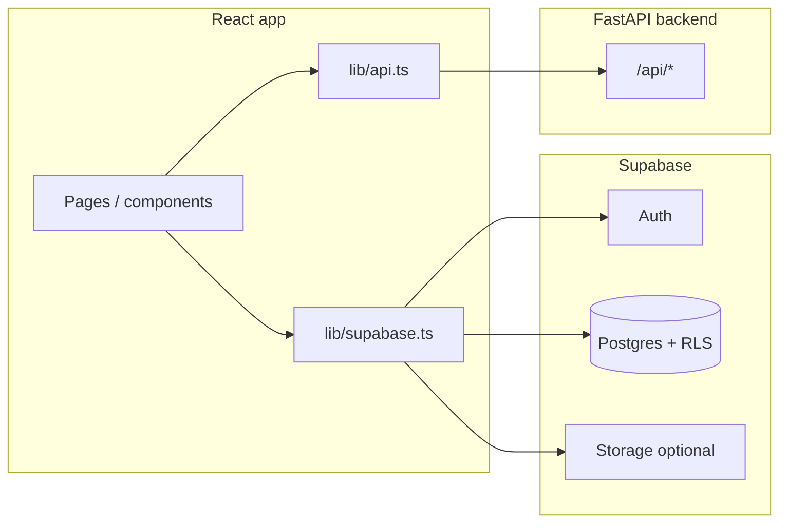

# Frontend developer handbook — RecruX (UI + integration)

Hand this to someone who will **change the UI** (and needs to know how the app is wired). It describes the **frontend**, how it talks to the **backend** and **Supabase**, and **where each feature lives** in the repo.

---

## 1. Repository layout (what matters for UI)

| Path | Purpose |
|------|---------|
| `frontend/` | **React + Vite + TypeScript** — this is the web app you will restyle. |
| `frontend/src/main.tsx` | **Routes** — all URLs and which page component loads. |
| `frontend/src/styles.css` | **Global CSS** — Tailwind layers + **CSS variables** (`:root`) for theme tokens. |
| `frontend/tailwind.config.ts` | Tailwind theme extensions (fonts, colors mapped to CSS vars). |
| `frontend/index.html` | Document title, **Google Fonts** links (DM Sans, Inter, Plus Jakarta Sans). |
| `frontend/.env` | **`VITE_*` only** — baked into the client at **build time**. Never put secrets (service keys) here except the public Supabase anon key. |
| `backend/` | FastAPI — **not** edited for pure CSS/visual work, but API contracts below matter. |
| `supabase/migrations/` | SQL for **Supabase** tables (profiles, saved jobs, etc.). |

---

## 2. Stack (frontend)

- **React 18**, **React Router v6**
- **Vite 5** (`npm run dev`, `npm run build`, `npm run preview`)
- **Tailwind CSS 3** + some **inline styles** (`style={{ color: "#..." }}`) in dashboard components — a UI pass may **consolidate** onto CSS variables.
- **lucide-react** icons
- **framer-motion** (used on some pages, e.g. Resume Match)
- **@supabase/supabase-js** — auth + database from the browser
- **axios** is listed in package.json; primary HTTP for API is **`fetch`** in `lib/api.ts`

---

## 3. How the system fits together



- **Supabase**: sign-in, user session, reading/writing **profiles**, **saved_jobs**, **applications**, **autoapply_settings**, etc.
- **FastAPI** (`VITE_API_URL`): resume parse/extract, job search, job scoring, chat, roadmap — see §7.

---

## 4. Environment variables (`frontend/.env`)

| Variable | Role |
|----------|------|
| `VITE_SUPABASE_URL` | Supabase project URL (public). |
| `VITE_SUPABASE_ANON_KEY` | Supabase **anon** key (public; RLS protects data). |
| `VITE_API_URL` | Base URL of FastAPI **without** `/api` — e.g. `http://127.0.0.1:8001`. Requests use `${VITE_API_URL}/api/...`. |

After changing `.env`, **restart** `npm run dev` and, for production, **rebuild** (`npm run build`) so new values are embedded.

---

## 5. Routing (source of truth: `src/main.tsx`)

| URL | Auth | Main component | Notes |
|-----|------|----------------|-------|
| `/` | Public if logged out | `LandingPage` | Logged-in users redirect to `/dashboard`. |
| `/signin`, `/signup`, `/reset-password`, `/auth/callback` | Public | Auth screens | |
| `/roadmap` | Public | `pages/RoadmapPage.tsx` | Marketing / static-style roadmap (not the dashboard AI roadmap). |
| `/dashboard` | Protected | `SearchJobsPage` | Default home after login. |
| `/dashboard/resume` | Protected | `ResumePage` | Tabs: upload + match. |
| `/dashboard/recent` | Protected | `RecentJobsPage` | |
| `/dashboard/autoapply` | Protected | `AutoApplyPage` | |
| `/dashboard/roadmap` | Protected | `ui/pages/RoadmapPage.tsx` | **AI roadmap** (different import name in `main.tsx`). |
| `/saved`, `/applied`, `/insights`, `/settings` | Protected | respective `ui/pages/*` | |
| `/dashboard/settings` | Protected | `SettingsPage` | Alias route. |
| `*` | — | Redirect to `/` or `/dashboard` | |

**Layout**: Most protected routes wrap content in **`Layout`** (`src/ui/Layout.tsx`): fixed **IconSidebar** (desktop), **header** strip, scrollable **main**, **BottomNav** (mobile).

---

## 6. Design system (where to change “the look”)

### 6.1 Global tokens — `src/styles.css`

`:root` defines **Linear-inspired light** tokens, e.g.:

- `--primary`, `--accent`, `--bg-page`, `--bg-card`, `--text-primary`, `--border`, success/danger, etc.

Changing these updates any component using `var(--...)` or Tailwind classes like `bg-bg-page`, `text-text-primary`.

### 6.2 Tailwind — `tailwind.config.ts`

- **Fonts**: `font-heading` → Plus Jakarta Sans; `font-body` → DM Sans (see `index.html` font links).
- **Colors**: many map to CSS variables; `brand.*` is a fixed purple scale — adjust if you rebrand.

### 6.3 Mixed styling

Some files use **hard-coded hex** (e.g. `#5E5CE6`, `#F7F7F5`) in `Layout.tsx`, `IconSidebar.tsx`, `JobCard.tsx`, `RoadmapPage.tsx`, etc. For a cohesive redesign, prefer **CSS variables** or **Tailwind** tokens so one place drives the theme.

### 6.4 Utility classes

- `.rounded-card` (8px), `.rounded-button` (6px), `.dashboard-main` (left margin for 220px sidebar on `md+`).

---

## 7. Backend API (what the UI calls)

Base: **`${VITE_API_URL}/api`**

Central client: **`src/lib/api.ts`** — attaches `Authorization: Bearer` from `localStorage` (`access_token` from Supabase session).

| Feature area | Typical function / usage | HTTP | Backend route |
|--------------|---------------------------|------|----------------|
| Resume extract (fast) | `extractResume` | POST multipart | `/resume/extract` |
| Resume parse (LLM) | `parseResume` | POST multipart | `/resume/parse` |
| Job search | `searchJobs` in `api/jobs.ts` + `useJobs` | POST JSON | `/jobs/search` |
| Batch job scores | `scoreJobsBatch` | POST | `/jobs/score` (shape per implementation) |
| Single job score | `scoreJob` | POST | `/jobs/score` |
| Chat | `chat` | POST JSON | `/chat` |
| Roadmap | dashboard `RoadmapPage` may use **raw `fetch`** to `/roadmap` | POST JSON | `/roadmap` |

**Swagger**: run backend and open `http://<api-host>:<port>/docs` for exact request/response schemas.

**CORS**: backend `main.py` lists allowed origins; new deploy URLs must be added there.

---

## 8. Supabase (what the UI touches)

Client: **`src/lib/supabase.ts`**

Typical usage patterns (grep `supabase.from` in `src/` for full list):

- **`profiles`**: resume metadata, `resume_text`, preferences, etc.
- **`saved_jobs`**, **`applications`**, **`job_views`**
- **`autoapply_settings`**

Row Level Security applies — frontend uses **anon key** only.

---

## 9. Feature → files (for targeted UI work)

### Shell & navigation

| Feature | Files |
|---------|--------|
| Dashboard frame (sidebar, header, main width) | `ui/Layout.tsx` |
| Left sidebar (desktop) | `ui/components/IconSidebar.tsx` |
| Mobile bottom nav | `ui/components/BottomNav.tsx` |
| Older/alternate sidebar | `ui/components/Sidebar.tsx` (if still referenced) |

### Auth & marketing

| Feature | Files |
|---------|--------|
| Landing | `pages/LandingPage.tsx` |
| Sign in / up / forgot / callback | `pages/SignIn.tsx`, `SignUp.tsx`, `ForgotPassword.tsx`, `AuthCallback.tsx` |
| Auth layout chrome | `components/AuthLayout.tsx` |
| Route guard | `components/ProtectedRoute.tsx` |
| Auth state | `context/AuthContext.tsx` |

### Jobs

| Feature | Files |
|---------|--------|
| Main job search | `ui/pages/SearchJobsPage.tsx` |
| Job list hook | `hooks/useJobs.ts` |
| Job API helpers | `api/jobs.ts` |
| Job card UI | `ui/components/JobCard.tsx` |
| Job detail side panel | `ui/components/JobDetailPanel.tsx` |
| Filters / preferences modal | `ui/components/PreferencesModal.tsx`, `FilterChip.tsx`, `TopBar.tsx` |
| Hero / copilot strip | `ui/components/HeroMatchBanner.tsx`, `AICopilotPanel.tsx` |
| Match badge | `ui/components/MatchBadge.tsx` |

### Resume

| Feature | Files |
|---------|--------|
| Resume tabs container | `ui/pages/ResumePage.tsx` |
| Upload | `ui/pages/ResumeUploadPage.tsx` |
| Match / analyze | `ui/pages/ResumeMatchPage.tsx` |
| Heuristic score | `lib/matchScore.ts` |

### Roadmap

| Feature | Files |
|---------|--------|
| Public marketing roadmap | `pages/RoadmapPage.tsx` |
| Logged-in AI roadmap | `ui/pages/RoadmapPage.tsx` |

### Other pages

| Feature | Files |
|---------|--------|
| Recent | `ui/pages/RecentJobsPage.tsx` |
| Saved | `ui/pages/SavedPage.tsx` |
| Applied | `ui/pages/AppliedPage.tsx` |
| Auto Apply | `ui/pages/AutoApplyPage.tsx` |
| Insights | `ui/pages/InsightsPage.tsx` (mostly placeholder) |
| Settings | `ui/pages/SettingsPage.tsx` |

### Shared UI

| Feature | Files |
|---------|--------|
| Toasts | `components/Toast.tsx` |
| Types for jobs | `types/jobs.ts` |

---

## 10. Behavioral notes (avoid breaking behavior when restyling)

- **Do not** rename routes in `main.tsx` without updating **every** `Link` / `navigate` / bookmark.
- **`lib/api.ts`**: on HTTP **401**, it clears token and sets `window.location.href = "/login"` — the app may use **`/signin`**; confirm route name if you touch auth flows.
- **Roadmap**: uses **`fetch`** + `VITE_API_URL` directly — styling-only changes are safe; don’t remove loading/error states without replacement.
- **Supabase**: table and column names must match **migrations** if you add forms that write new fields.

---

## 11. Commands

```bash
cd frontend
npm install
npm run dev          # development
npm run build        # production bundle → dist/
npm run preview      # serve dist locally
npm run lint         # eslint
```

---

## 12. Related docs in this repo

- `ARCHITECTURE-AND-MANUAL-TESTS.md` — architecture + manual test ideas  
- `PRE-DEPLOY-TEST-CHECKLIST.md` — pre-release QA checklist  
- `BRAND-DIFFERENTIATION.md` — product/brand positioning notes  

---

## 13. Summary for a UI-focused developer

1. **Theme**: start with **`styles.css` `:root`** and **`tailwind.config.ts`**, then reduce **duplicate hex** in components.  
2. **Shell**: **`Layout.tsx`**, **`IconSidebar.tsx`**, **`BottomNav.tsx`** define the overall silhouette.  
3. **Features**: map UX to files using **§9**.  
4. **Data**: **Supabase** (user data) vs **FastAPI** (AI/job APIs) — **§3, §7, §8**.  
5. **No backend required** for static/CSS-only work; run **Vite** and mock or point to staging API/Supabase as needed.

*Last updated to match repo layout; adjust routes/names if the codebase drifts.*
